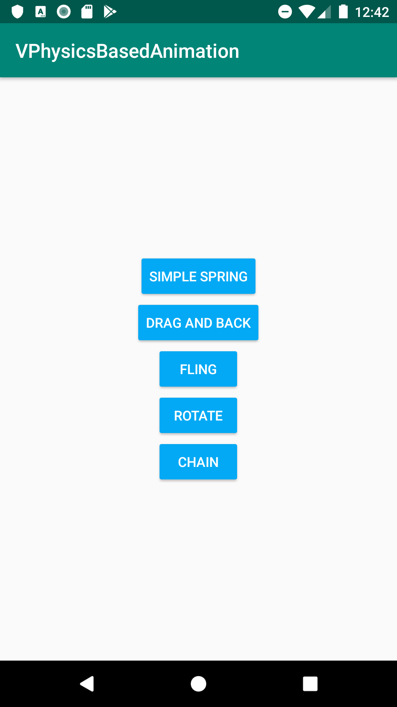

# VPhysicsBasedAnimation presents...Some example using Physics Based in Android

## Main Screen

    

## Spring Animation

## Spring with Force

## Spring Rotate

## Fling Animation

## Chain spring animation

